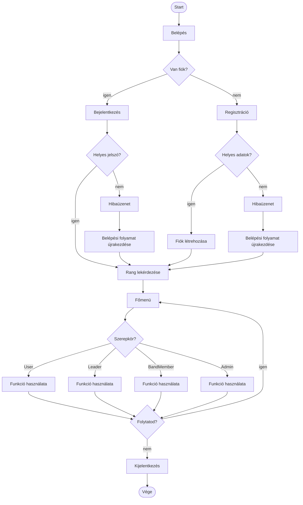

# Activity

```mermaid
flowchart TD
    Start([Start]) --> Belepes[Belépés]
    Belepes --> VanFiok{Van fiók?}

    VanFiok -- igen --> Bejelentkezes[Bejelentkezés]
    Bejelentkezes --> HelyesJelszo{Helyes jelszó?}
    HelyesJelszo -- igen --> RangLekerdezes[Rang lekérdezése]
    HelyesJelszo -- nem --> HibaUzenet1[Hibaüzenet]
    HibaUzenet1 --> Ujra1[Belépési folyamat újrakezdése]
    Ujra1 --> RangLekerdezes

    VanFiok -- nem --> Regisztracio[Regisztráció]
    Regisztracio --> HelyesAdatok{Helyes adatok?}
    HelyesAdatok -- igen --> FiokLetrehozas[Fiók létrehozása]
    FiokLetrehozas --> RangLekerdezes
    HelyesAdatok -- nem --> HibaUzenet2[Hibaüzenet]
    HibaUzenet2 --> Ujra2[Belépési folyamat újrakezdése]
    Ujra2 --> RangLekerdezes

    RangLekerdezes --> Fomenu[Főmenü]
    Fomenu --> Szerepkor{Szerepkör?}
    Szerepkor -- User --> FunkcioUser[Funkció használata]
    Szerepkor -- Leader --> FunkcioLeader[Funkció használata]
    Szerepkor -- BandMember --> FunkcioMember[Funkció használata]
    Szerepkor -- Admin --> FunkcioAdmin[Funkció használata]

    FunkcioUser --> Folytatod{Folytatod?}
    FunkcioLeader --> Folytatod
    FunkcioMember --> Folytatod
    FunkcioAdmin --> Folytatod

    Folytatod -- igen --> Fomenu
    Folytatod -- nem --> Kijelentkezes[Kijelentkezés]
    Kijelentkezes --> Vege([Vége])
```
