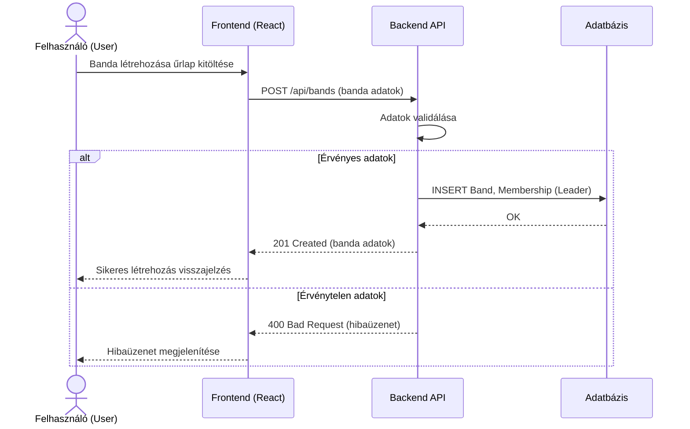

# BandaLetrehozasa

```mermaid
sequenceDiagram
    actor U as Felhasználó (User)
    participant FE as Frontend (React)
    participant BE as Backend API
    participant DB as Adatbázis

    U->>FE: Banda létrehozása űrlap kitöltése
    FE->>BE: POST /api/bands (banda adatok)
    BE->>BE: Adatok validálása
    alt Érvényes adatok
        BE->>DB: INSERT Band, Membership (Leader)
        DB-->>BE: OK
        BE-->>FE: 201 Created (banda adatok)
        FE-->>U: Sikeres létrehozás visszajelzés
    else Érvénytelen adatok
        BE-->>FE: 400 Bad Request (hibaüzenet)
        FE-->>U: Hibaüzenet megjelenítése
    end
```
