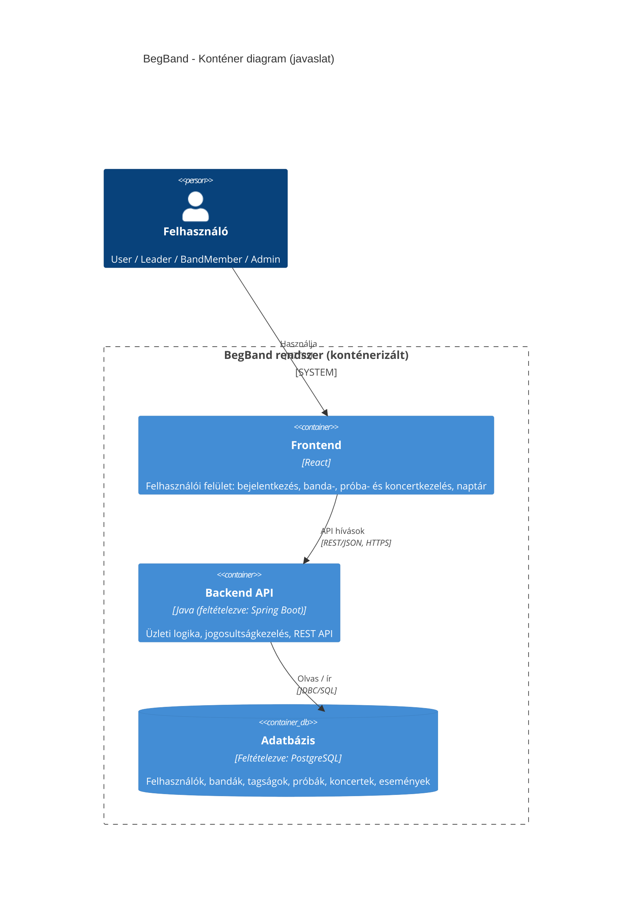

# Container

```mermaid
C4Container
    title BegBand - Konténer diagram (javaslat)

    Person(user, "Felhasználó", "User / Leader / BandMember / Admin")

    System_Boundary(begband, "BegBand rendszer (konténerizált)") {
        Container(frontend, "Frontend", "React", "Felhasználói felület: bejelentkezés, banda-, próba- és koncertkezelés, naptár")
        Container(backend, "Backend API", "Java (feltételezve: Spring Boot)", "Üzleti logika, jogosultságkezelés, REST API")
        ContainerDb(db, "Adatbázis", "Feltételezve: PostgreSQL", "Felhasználók, bandák, tagságok, próbák, koncertek, események")
    }

    Rel(user, frontend, "Használja", "HTTPS")
    Rel(frontend, backend, "API hívások", "REST/JSON, HTTPS")
    Rel(backend, db, "Olvas / ír", "JDBC/SQL")
```
