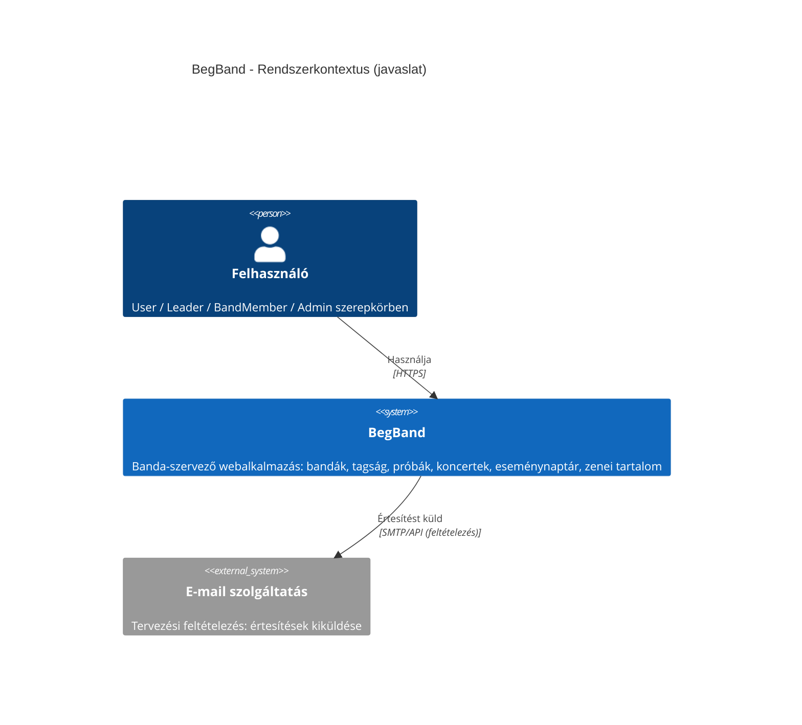

# Context

```mermaid
C4Context
    title BegBand - Rendszerkontextus (javaslat)

    Person(user, "Felhasználó", "User / Leader / BandMember / Admin szerepkörben")
    System(begband, "BegBand", "Banda-szervező webalkalmazás: bandák, tagság, próbák, koncertek, eseménynaptár, zenei tartalom")
    System_Ext(email, "E-mail szolgáltatás", "Tervezési feltételezés: értesítések kiküldése")

    Rel(user, begband, "Használja", "HTTPS")
    Rel(begband, email, "Értesítést küld", "SMTP/API (feltételezés)")
```
