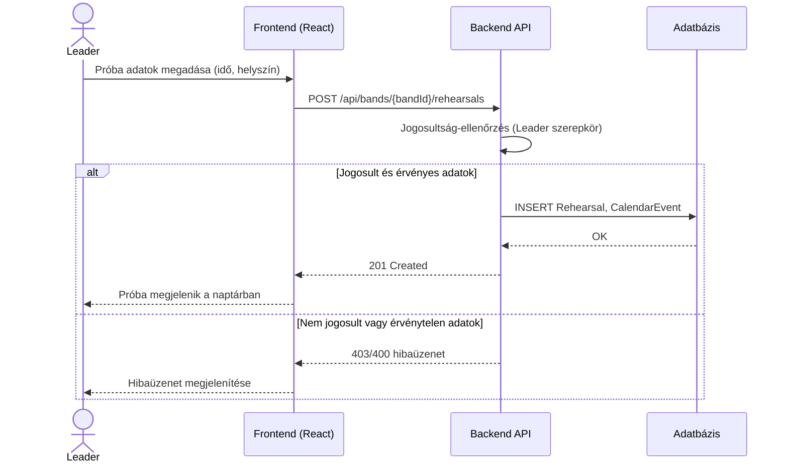

# ProbaLetrehozasa

```mermaid
sequenceDiagram
    actor L as Leader
    participant FE as Frontend (React)
    participant BE as Backend API
    participant DB as Adatbázis

    L->>FE: Próba adatok megadása (idő, helyszín)
    FE->>BE: POST /api/bands/{bandId}/rehearsals
    BE->>BE: Jogosultság-ellenőrzés (Leader szerepkör)
    alt Jogosult és érvényes adatok
        BE->>DB: INSERT Rehearsal, CalendarEvent
        DB-->>BE: OK
        BE-->>FE: 201 Created
        FE-->>L: Próba megjelenik a naptárban
    else Nem jogosult vagy érvénytelen adatok
        BE-->>FE: 403/400 hibaüzenet
        FE-->>L: Hibaüzenet megjelenítése
    end
```
