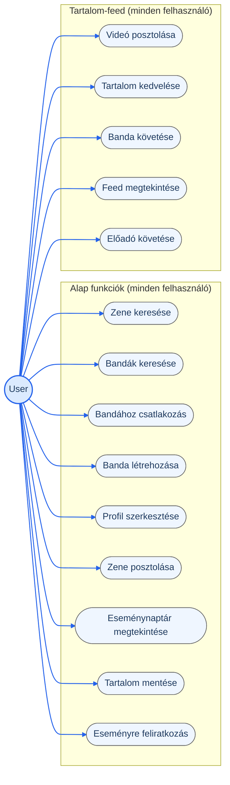
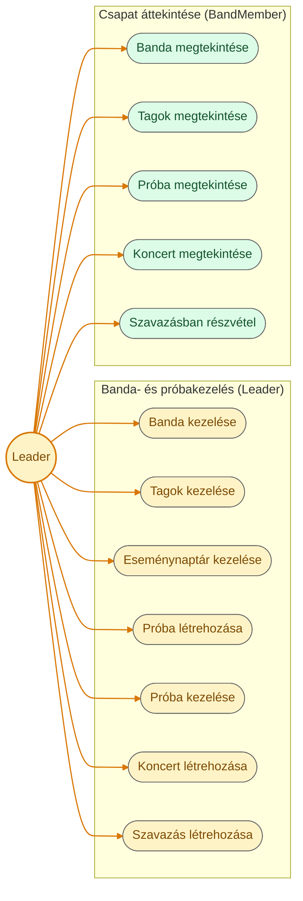
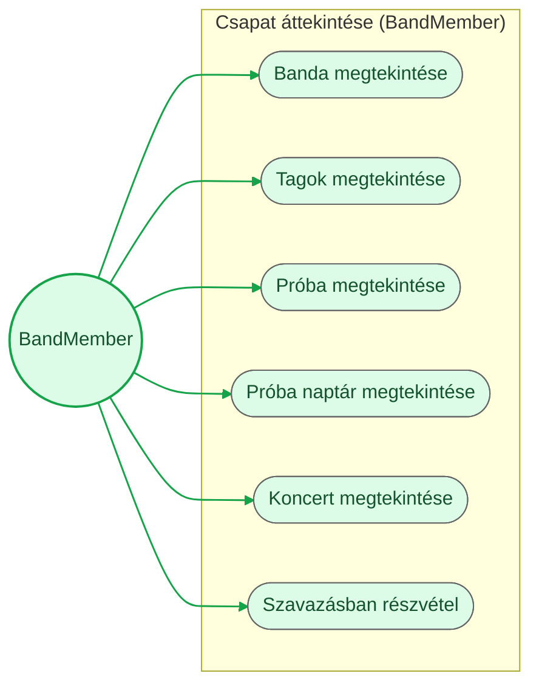
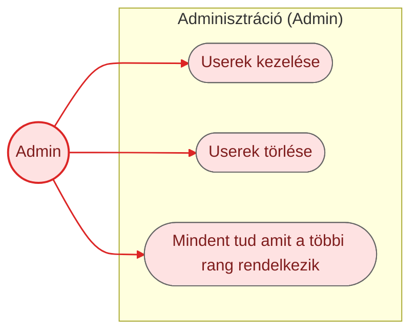

# UseCase

## Use case katalógus (funkcionális csoportok)

```mermaid
flowchart TB
    subgraph PKG_Common["Alap funkciók (minden felhasználó)"]
        direction TB
        C1(["Zene keresése"])
        C2(["Bandák keresése"])
        C3(["Bandához csatlakozás"])
        C4(["Banda létrehozása"])
        C5(["Profil szerkesztése"])
        C6(["Zene posztolása"])
        C7(["Eseménynaptár megtekintése"])
        C8(["Tartalom mentése"])
        C9(["Eseményre feliratkozás"])
    end

    subgraph PKG_Feed["Tartalom-feed (minden felhasználó)"]
        direction TB
        F1(["Videó posztolása"])
        F2(["Tartalom kedvelése"])
        F3(["Banda követése"])
        F4(["Feed megtekintése"])
        F5(["Előadó követése"])
    end

    subgraph PKG_Leader["Banda- és próbakezelés (Leader)"]
        direction TB
        L1(["Banda kezelése"])
        L2(["Tagok kezelése"])
        L3(["Eseménynaptár kezelése"])
        L4(["Próba létrehozása"])
        L5(["Próba kezelése"])
        L6(["Koncert létrehozása"])
        L7(["Szavazás létrehozása"])
    end

    subgraph PKG_Member["Csapat áttekintése (BandMember)"]
        direction TB
        M1(["Banda megtekintése"])
        M2(["Tagok megtekintése"])
        M3(["Próba megtekintése"])
        M4(["Próba naptár megtekintése"])
        M5(["Koncert megtekintése"])
        M6(["Szavazásban részvétel"])
    end

    subgraph PKG_Admin["Adminisztráció (Admin)"]
        direction TB
        A1(["Userek kezelése"])
        A2(["Userek törlése"])
        A3(["Mindent tud amit a többi rang rendelkezik"])
    end

    classDef common fill:#EFF6FF,stroke:#666666,color:#1e3a5f
    classDef leaderUC fill:#FEF3C7,stroke:#666666,color:#7c4a03
    classDef memberUC fill:#DCFCE7,stroke:#666666,color:#14532d
    classDef adminUC fill:#FEE2E2,stroke:#666666,color:#7f1d1d

    class C1,C2,C3,C4,C5,C6,C7,C8,C9,F1,F2,F3,F4,F5 common
    class L1,L2,L3,L4,L5,L6,L7 leaderUC
    class M1,M2,M3,M4,M5,M6 memberUC
    class A1,A2,A3 adminUC
```

## User use case-ei

```mermaid
flowchart LR
    User(("User"))

    subgraph PKG_Common["Alap funkciók (minden felhasználó)"]
        direction TB
        C1(["Zene keresése"])
        C2(["Bandák keresése"])
        C3(["Bandához csatlakozás"])
        C4(["Banda létrehozása"])
        C5(["Profil szerkesztése"])
        C6(["Zene posztolása"])
        C7(["Eseménynaptár megtekintése"])
        C8(["Tartalom mentése"])
        C9(["Eseményre feliratkozás"])
    end

    subgraph PKG_Feed["Tartalom-feed (minden felhasználó)"]
        direction TB
        F1(["Videó posztolása"])
        F2(["Tartalom kedvelése"])
        F3(["Banda követése"])
        F4(["Feed megtekintése"])
        F5(["Előadó követése"])
    end

    User --> C1
    User --> C2
    User --> C3
    User --> C4
    User --> C5
    User --> C6
    User --> C7
    User --> C8
    User --> C9
    User --> F1
    User --> F2
    User --> F3
    User --> F4
    User --> F5

    classDef common fill:#EFF6FF,stroke:#666666,color:#1e3a5f
    classDef userActor fill:#DBEAFE,stroke:#2563EB,stroke-width:2px,color:#1e3a5f

    class C1,C2,C3,C4,C5,C6,C7,C8,C9,F1,F2,F3,F4,F5 common
    class User userActor
    linkStyle 0,1,2,3,4,5,6,7,8,9,10,11,12,13 stroke:#2563EB,stroke-width:1.5px
```

## Leader use case-ei

```mermaid
flowchart LR
    Leader(("Leader"))

    subgraph PKG_Leader["Banda- és próbakezelés (Leader)"]
        direction TB
        L1(["Banda kezelése"])
        L2(["Tagok kezelése"])
        L3(["Eseménynaptár kezelése"])
        L4(["Próba létrehozása"])
        L5(["Próba kezelése"])
        L6(["Koncert létrehozása"])
        L7(["Szavazás létrehozása"])
    end

    subgraph PKG_Member["Csapat áttekintése (BandMember)"]
        direction TB
        M1(["Banda megtekintése"])
        M2(["Tagok megtekintése"])
        M3(["Próba megtekintése"])
        M5(["Koncert megtekintése"])
        M6(["Szavazásban részvétel"])
    end

    Leader --> L1
    Leader --> L2
    Leader --> L3
    Leader --> L4
    Leader --> L5
    Leader --> L6
    Leader --> L7
    Leader --> M1
    Leader --> M2
    Leader --> M3
    Leader --> M5
    Leader --> M6

    classDef leaderUC fill:#FEF3C7,stroke:#666666,color:#7c4a03
    classDef memberUC fill:#DCFCE7,stroke:#666666,color:#14532d
    classDef leaderActor fill:#FEF3C7,stroke:#D97706,stroke-width:2px,color:#7c4a03

    class L1,L2,L3,L4,L5,L6,L7 leaderUC
    class M1,M2,M3,M5,M6 memberUC
    class Leader leaderActor
    linkStyle 0,1,2,3,4,5,6,7,8,9,10,11 stroke:#D97706,stroke-width:1.5px
```

## BandMember use case-ei

```mermaid
flowchart LR
    BandMember(("BandMember"))

    subgraph PKG_Member["Csapat áttekintése (BandMember)"]
        direction TB
        M1(["Banda megtekintése"])
        M2(["Tagok megtekintése"])
        M3(["Próba megtekintése"])
        M4(["Próba naptár megtekintése"])
        M5(["Koncert megtekintése"])
        M6(["Szavazásban részvétel"])
    end

    BandMember --> M1
    BandMember --> M2
    BandMember --> M3
    BandMember --> M4
    BandMember --> M5
    BandMember --> M6

    classDef memberUC fill:#DCFCE7,stroke:#666666,color:#14532d
    classDef memberActor fill:#DCFCE7,stroke:#16A34A,stroke-width:2px,color:#14532d

    class M1,M2,M3,M4,M5,M6 memberUC
    class BandMember memberActor
    linkStyle 0,1,2,3,4,5 stroke:#16A34A,stroke-width:1.5px
```

## Admin use case-ei

```mermaid
flowchart LR
    Admin(("Admin"))

    subgraph PKG_Admin["Adminisztráció (Admin)"]
        direction TB
        A1(["Userek kezelése"])
        A2(["Userek törlése"])
        A3(["Mindent tud amit a többi rang rendelkezik"])
    end

    Admin --> A1
    Admin --> A2
    Admin --> A3

    classDef adminUC fill:#FEE2E2,stroke:#666666,color:#7f1d1d
    classDef adminActor fill:#FEE2E2,stroke:#DC2626,stroke-width:2px,color:#7f1d1d

    class A1,A2,A3 adminUC
    class Admin adminActor
    linkStyle 0,1,2 stroke:#DC2626,stroke-width:1.5px
```
